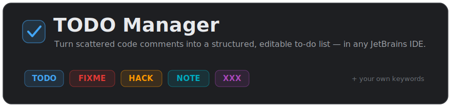
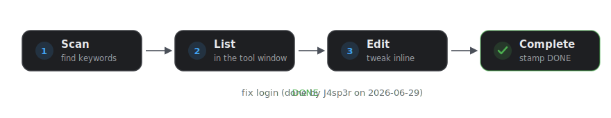
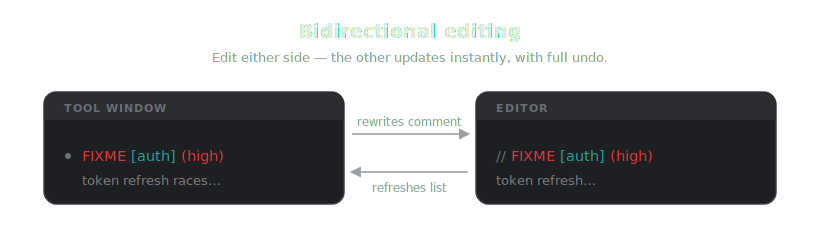
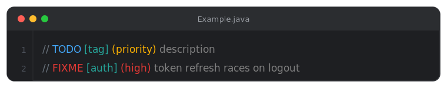
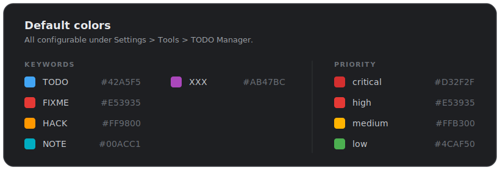

<p align="center">
  
</p>

A JetBrains IDE plugin that turns scattered `TODO`, `FIXME`, `HACK`, `NOTE`, and `XXX`
comments in your code — in **any language** — into a structured, editable to-do list, with a
dedicated tool window, editor highlighting, and two-way editing.

<p align="center">
  
</p>

## Features

- **Tool window** with a tree view of every TODO in the project, grouped by **file**, **tag**, or **priority**.
- **Bidirectional editing** — change a TODO's description, tag, or priority from the panel
  and the source comment is rewritten in place, with full undo support.
- **Editor highlighting** — keywords, tags, priorities, description text, and comment delimiters are colorized right in the editor.
- **Add & complete** — insert new TODOs at the caret position, or mark existing ones done.
  Completing a TODO stamps it with your git user name and the date
  (e.g. `DONE fix login (done by J4sp3r on 2026-06-29)`).
- **Done items, kept in view** — completed TODOs stay in the list, struck through and labelled
  with who finished them and when. Toggle them on or off with **Show done** in the toolbar.
- **General (code-free) TODOs** — track items that aren't tied to any comment. Check
  *General TODO* in the New TODO dialog; they're stored with the project and shown alongside
  code TODOs.
- **Fully configurable** — customize keywords and all colors under *Settings > Tools > TODO Manager*.
- **Precise keyword matching** — choose how keyword **case** is matched (any case, upper-case only,
  or lower-case only, so a lower-case `note` in prose isn't mistaken for the `NOTE` keyword) and
  optionally require a keyword to be the **first word on its line** (so keywords appearing
  mid-sentence are ignored). Defaults to any case / match anywhere.
- **No double highlighting** — optionally suppress the IDE's own built-in TODO highlighting
  (*Settings > Editor > TODO*) so it doesn't overlap this plugin's. Turning it back off restores
  the IDE's patterns. (If you uninstall the plugin while it's on, restore them via
  *Settings > Editor > TODO > Reset to Defaults*.)
- **Auto-refresh** as you edit files.

<p align="center">
  
</p>

## Comment format

TODO Manager understands a structured comment format — each part is colorized in the editor:

<p align="center">
  
</p>

| Part | Syntax | Example | Notes |
|------|--------|---------|-------|
| Keyword | `TODO`, `FIXME`, … | `TODO` | Configurable list |
| Tag | `[tag]` | `[auth]` | Optional |
| Priority | `(priority)` | `(high)` | `critical` / `high` / `medium` / `low`, optional |
| Description | free text | `fix login` | |

Works in any comment the IDE recognizes — line comments (`//`, `#`, `--`), block comments
(`/* */`, `<!-- -->`), and doc comments — across every supported language.

## Colors

Sensible defaults out of the box, all customizable under *Settings > Tools > TODO Manager*.
Tag colors are assigned automatically from a palette (with per-tag overrides available).

<p align="center">
  
</p>

## Requirements

- Any IntelliJ-based IDE **2025.1+** (IntelliJ IDEA, WebStorm, PyCharm, GoLand, PhpStorm,
  Rider, CLion, RubyMine, Android Studio, …).

## Building from source

```bash
./gradlew buildPlugin
```

The installable zip is written to `build/distributions/`.

## License

[MIT](LICENSE) © J4sp3r
